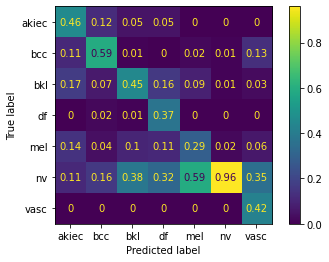
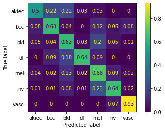

# skin-care

## Description
In this project I was tasked with creating a neural network that can identify images of skin lesions in 7 classes and with deploying this model.  This project was based on [This Kaggle Challenge](https://www.kaggle.com/datasets/kmader/skin-cancer-mnist-ham10000?select=HAM10000_metadata.csv). The neural net is inspired on the [AlexNet](https://dl.acm.org/doi/10.1145/3065386) architecture. I had about 10 days to finish this project.

The deployed app can be found [here](https://ancient-bastion-46676.herokuapp.com/)

## Installation

### The app

To run the app one can create a Docker container with the Dockerfile. If you are not familiar with docker, you can create a virtual environment and download everything mentioned in the requirements.txt file. Then run app.py. Open a browser. The app should load when surfing to [http://127.0.0.1:4000/](http://127.0.0.1:4000/)

### Notebooks
This repository also contains two notebooks. These notebooks were used to create the neural net and are not necessary for running the app. 

The notebooks expect the [HMNIST dataset](https://www.kaggle.com/datasets/kmader/skin-cancer-mnist-ham10000?select=HAM10000_metadata.csv), downloaded inside a folder called data. The folder_creator.ipynb notebook will create new directories from this data based on the type of lesion and wether it should go in the train, test or validation set.
The model_creator.ipynb is where the model is trained.

## Usage

You can upload a .jpg file. Then it will give a number of predictions in the form of percentages for each of the seven types of lesion.

## The data and model

The seven classes of moles were highly unblanced. To account for this all classes where upsampled to the largest class. The model itself has a few augentation layers so it doesn't actually see any image twice. After training the model on this upsampled data we trained the model. 

### Evaluation

The model was tested on the set aside test set. Keep in mind that this test set is untouched but therefore unbalanced. The chance that the model's prediction is correct is about 78%. Keep in mind that the main contributor to this score is the majority class with 96%. The chance that a model with predicted A falls in class B can be found in the following confusion matrix:

Additionally we mention that the chance that a mole of certain class ends up being classified correctly is about 64%.

